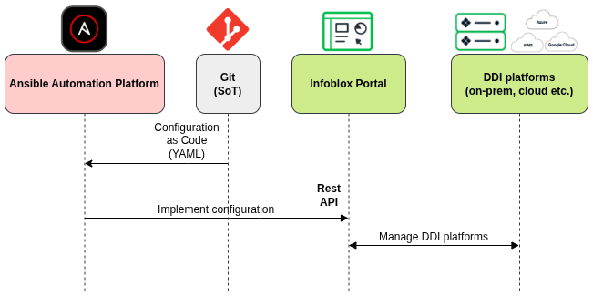
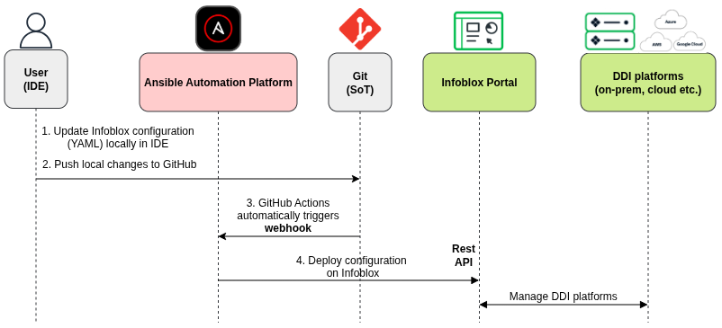
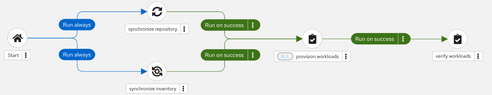
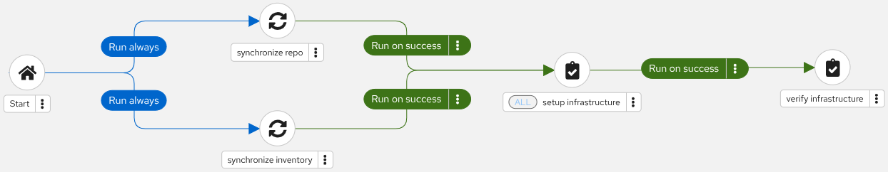

# Automating Infoblox with Ansible Automation Platform

This project provides an example of automating Infoblox Universal DDI configuration using Ansible Automation Platform (AAP). It takes a **Configuration as Code** (CaC) approach: the desired state of DDI environment is defined in YAML files and applied to Infoblox through Ansible playbooks.

## Architecture


### How It Works

1. **Configuration as Code:** DDI configuration is defined in `inventory/host_vars/infoblox_portal/` which is Source of Truth (SoT) for our configuration. Each resource type has its own file with related variables(ip_spaces, dns_views, subnets, zones, hosts). To make configuration change on Infoblox (adding a new subnet, zone etc.) we have to edit the relevant file and do Git commit/push.

2. **Execution Environment:** Playbooks run inside a containerized environment that includes Ansible packages, collections, Python dependencies and other content/dependencies that are required to run our automation. This ensures consistency across developer machines and AAP. Execution Environment is defined in `execution-environment.yml` file.

3. **The following Ansible roles have been created:**
   - **`infrastructure_setup`:** Creates basic infrastructure: IP Spaces, DNS Views, Subnets, and DNS Zones
   - **`infrastructure_verify`:** Queries and displays current DDI infrastructure (IP Spaces, DNS Views, Subnets, Zones)
   - **`workload_provision`:** Provisions hosts within that infrastructure: allocates IPs, creates DNS records and optionally creates DHCP reservations
   - **`workload_verify`:** Queries and displays provisioned workloads (DNS records, DHCP reservations)

4. **Idempotency:** Ansible playbooks are idempotent which means that Ansible only makes changes when the actual state differs from the defined state.If defined state is already configured Ansible detects it and doesn't overwrite the configuration.


## How To Use It

### Set API Key

- If running playbooks with ansible-navigator tool from CLI export your Infoblox portal API key as an environment variable:

```bash
export INFOBLOX_PORTAL_KEY="your-api-key-here"
```

Optionally set the portal URL (defaults to `https://csp.infoblox.com`):

```bash
export INFOBLOX_PORTAL_URL="https://csp.infoblox.com"
```

- If running playbooks from Ansible Automation Platform define Custom Credential Types. See the example below:  

**Input configuration:**
```
fields:
  - id: infoblox_portal_api_key
    type: string
    label: Infoblox Portal API Key
    secret: false
  - id: infoblox_portal_url
    type: string
    label: Infoblox Portal URL
    secret: true
```
**Injector configuration:**
```
env:
  INFOBLOX_PORTAL_KEY: '{{ infoblox_portal_api_key }}'
  INFOBLOX_PORTAL_URL: '{{ infoblox_portal_url }}'
```

### Configuration Workflow

Ansible Automation Platform enables powerful workflow automation patterns for managing Infoblox DDI infrastructure. In this repository CaC driven workflow is used.
#### CaC Workflow

1. Edit locally host_vars YAML files (ip_spaces, subnets, zones, hosts etc.)
2. Commit & push changes to GitHub (this repository)
3. GitHub Actions & webhook triggers AAP Workflow Job Template



The GitHub Actions workflow (`.github/workflows/deploy-ddi.yml`) triggers automatically on push to `main` branch when any file under `inventory/host_vars/` changes. It detects which files changed and triggers the appropriate AAP Workflow Job Template:

- **Infrastructure AAP Workflow** for Infrastructure changes (`ip_spaces.yml`, `dns_views.yml`, `subnets.yml`, `zones.yml`)
- **Workload AAP Workflow** for Workload changes (`hosts.yml`)

If both types change in the same commit both workflows run in parallel.

The following GitHub repository secrets must be configured:

| Secret | Description |
|---|---|
| `WEBHOOK_URL_INFRA` | AAP webhook URL for the Infrastructure Workflow Job Template |
| `WEBHOOK_SECRET_INFRA` | AAP webhook secret for the Infrastructure Workflow Job Template |
| `WEBHOOK_URL_WORKLOAD` | AAP webhook URL for the Workload Workflow Job Template |
| `WEBHOOK_SECRET_WORKLOAD` | AAP webhook secret for the Workload Workflow Job Template |

### AAP Workflow Job Templates

Each AAP Workflow Job Template follows the same pattern:

1. **Synchronize repository** and **synchronize inventory** run in parallel (both triggered on start) to ensure AAP has the latest project code and host_vars
2. The main job template (**setup infrastructure** or **provision workloads**) runs only after both synchronization steps succeed (ALL convergence)
3. The verification job template (**verify infrastructure** or **verify workloads**) runs on success of the main job

AAP Provision Workload Workflow:  


AAP Setup Infrastructure Workflow:  



## Other Possible Infoblox Automation Use Cases
Depending on our needs there can be many other possible use cases for automating Infoblox with AAP. To showcase this here are two examples of workflows that aren't based on a CaC approach (not covered in this repository):

### Self-Service host provisioning via AAP Survey

AAP Surveys allow users to provision hosts without editing variables in yaml files. AAP job template presents a web form in browser where users fill in host details and AAP Implements hosts configuration based on provided input data. This workflow enables self-service for teams that need DNS/DHCP records etc.

1. User fills AAP Survey (FQDN, subnet CIDR, MAC, owner, environment, ticket)
2. AAP runs automation Workflow Job Template for provided data:
   - workload_provision.yml
   - workload_verify.yml
   - sent notification with provisioned host details (email, Slack/Teams etc.)

### ServiceNow-initiated host provisioning

ServiceNow can be integrated with AAP to provide ITSM-driven host provisioning. A user submits a ServiceNow Catalog Item with host details. ServiceNow calls AAP REST API to launch a Workflow Job Template that provisions the host in Infoblox and updates the ServiceNow request with results.

1. User submits ServiceNow Catalog Item (FQDN, subnet CIDR, MAC, environment, owner)
2. ServiceNow sends REST API call to AAP to launch Workflow Job Template with the provided data
3. AAP runs automation Workflow Job Template:
   - workload_provision.yml (allocate IP, create DNS record, DHCP reservation)
   - workload_verify.yml (verify provisioning)
   - playbook using servicenow.itsm collection to update and close ServiceNow request with provisioned host details


## AAP Configuration as Code

AAP Workflows used in this project are defined in CaC fashion in the following repo:  
https://github.com/mzdyb/aap-configuration-as-code

## Author

[Michal Zdyb](https://www.linkedin.com/in/michal-zdyb-9aa4046/)

